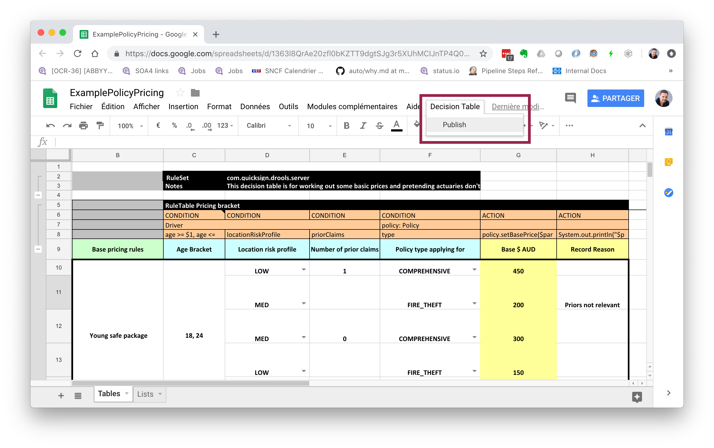

# google-drive-sync-test

## Overview

Google Sheet document -> TravisCI + Github repository @ `build` -> Github repository @ `master` as Excel document -> [Knative Build with Drools Server buildpack.]

NB: The Knative build part is not done yet and could be replaced with a direct docker image build.



## Workflow

- Google Sheet user triggers the [Travis CI](https://travis-ci.com) job on branch `build` using some Google Script code.
- Travis CI invokes the `sync.py` script
- The `sync.py` script exports a Google Sheet identified by the `GOOGLE_SHEET_FILE_ID` environement variable as an Excel document in the `./build/` directory which is then exported to the `master` branch using the TravisCI `pages` plugin.

## Environment variables

| Environment variable   | Description                                                                          |
|------------------------|--------------------------------------------------------------------------------------|
| `GITHUB_TOKEN`         | Used to push the `./build` directory to the `master` branch                          |
| `GOOGLE_SHEET_FILE_ID` | ID of the Google Sheet document to export as Excel                                   |
| `GPG_KEY`              | GPG key used to decrypt the GCP Service Account JSON file `service-account.json.gpg` |

## Mutual authentication (Callback mechanism)

- The Google Script which triggers the TravisCI build authenticates using a TravisCI `API Token`.
- The TravisCI build authenticates using a GCP Service Account JSON file encrypted using GPG using a key stored as a TravisCI secure variable.

The TravisCI build doesn't take for granted what it receives from the web trigger, it fetches itself the Google Sheet document from GCP. Both sides verify the other.

## Sample Google Script to trigger the Github build

Paste the following code in the Google Sheet script editor and replace the `<YOUR_TRAVISCI_TOKEN>`, `branch`, `user` and `repo` parameters :

```javascript
function onOpen() {
  var ui = SpreadsheetApp.getUi();
  ui.createMenu('Github')
      .addItem('Build', 'build')
      .addToUi();
}

function build() {

  var token = '<YOUR_TRAVISCI_TOKEN>';
  var branch = 'deploy';
  var user = 'cedricvidal';
  var repo = 'google-drive-sync-test';

  var headers = { 
    "Authorization" : "token " + token,
    "Travis-API-Version": "3"
  };

  var body = {
    "request": {
      "branch": branch
    }
  };

  var options =
   {
     "contentType" : "application/json",
     "method" : "post",
     "headers" : headers,
     "payload" : JSON.stringify(body)
   };

  var url = "https://api.travis-ci.com/repo/" + user +"%2F" + repo + "/requests";

  var response = UrlFetchApp.fetch(url, options);

  SpreadsheetApp.getActiveSpreadsheet()
   .toast("Published document", "Decision Table");
}

```
